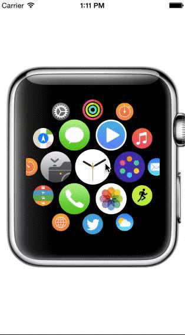

#LEWatchLayout

Apple Watch Layout base on UICollectionViewLayout



Simple usage:

- copy folder `LEWatchLayout` to your project 

- import `LECollectionWatchLayout.h` to where need it

- use layout

``` objective-c
self.collectionView = [[UICollectionView alloc] initWithFrame:CGRectMake(0.0, 0.0, 320.0, 320.0) collectionViewLayout:[[LECollectionViewWatchLayout alloc] init]];
[self.collectionView registerClass:[LETestImageCell class] forCellWithReuseIdentifier:cellIdentifier];
```

- date source write like this

``` objective-c
- (NSInteger)collectionView:(UICollectionView *)collectionView numberOfItemsInSection:(NSInteger)section
{
    return 19;//37;
}

- (UICollectionViewCell *)collectionView:(UICollectionView *)collectionView cellForItemAtIndexPath:(NSIndexPath *)indexPath
{
    LETestImageCell *cell = (LETestImageCell *)[collectionView dequeueReusableCellWithReuseIdentifier:cellIdentifier forIndexPath:indexPath];
    cell.imageView.image = [UIImage imageNamed:images[[indexPath row]%[images count]]];
    return cell;
}
```

#Licensing

[MIT-LICENSE](http://opensource.org/licenses/MIT)

#Contributions

